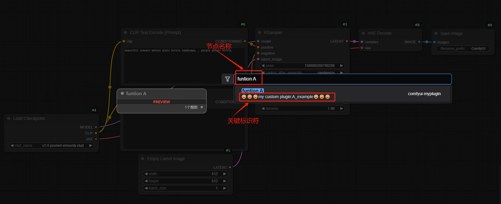
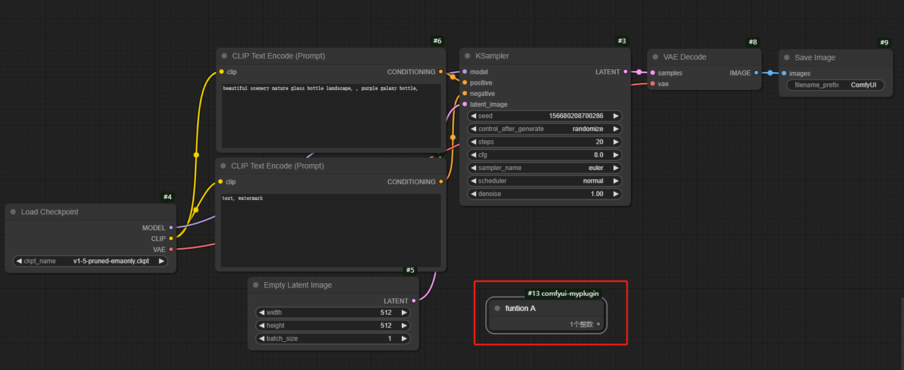
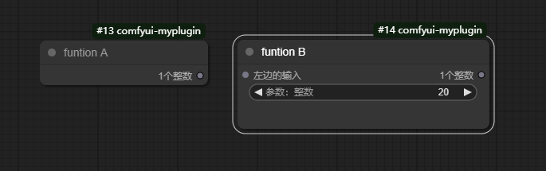
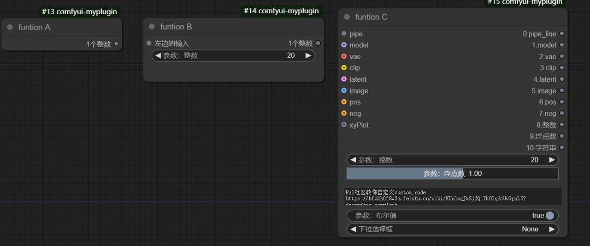
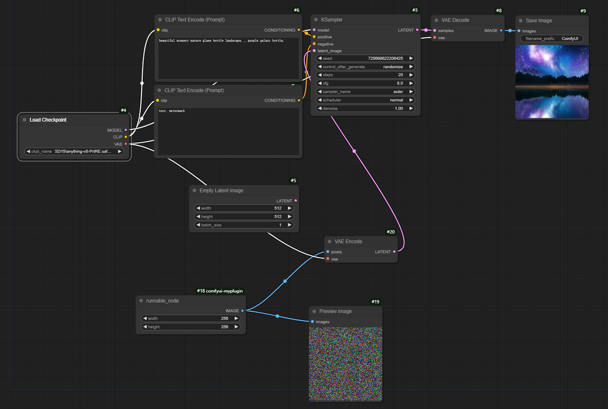
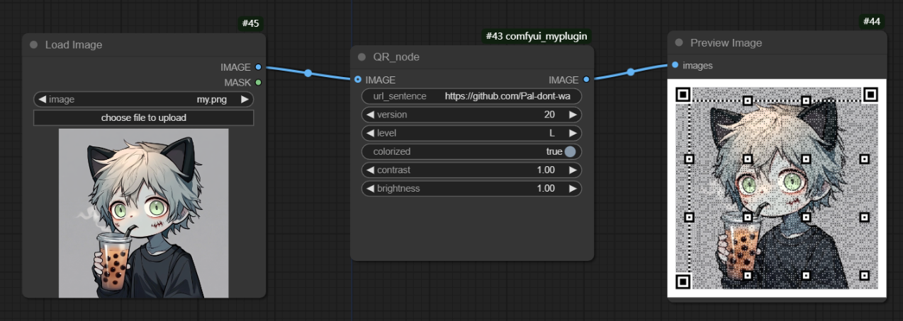

这是一个全面的ComfyUI自定义节点插件开发教程。本项目旨在指导开发者如何创建、实现和集成自定义节点到ComfyUI中。通过一系列由浅入深的示例，我们将展示从基础节点结构到复杂功能实现的全过程。

本教程不仅包含了多个实用的示例节点，还详细解释了每个开发步骤，是学习ComfyUI插件开发的理想资源。无论您是ComfyUI新手还是有经验的开发者，都能在这里找到有价值的信息。

## 教程内容

本教程涵盖以下内容：

- ComfyUI插件开发基础
- 节点结构和属性定义
- 输入和输出类型配置
- 实现节点功能逻辑
- 高级功能示例（如QR码生成器）


通过学习本教程，您将能够：

- 理解ComfyUI插件的工作原理
- 创建各种类型的自定义节点
- 实现复杂的节点功能，将自定义节点集成到ComfyUI工作流程中

## 目录


- [安装](#安装)
- [使用方法](#使用方法)
- [节点详解](#节点详解)
- [开发指南](#开发指南)


## 安装

1. 下载并安装最新版本的ComfyUI：
   ```
   git clone https://github.com/comfyanonymous/ComfyUI.git
   cd ComfyUI
   ```

2. 在ComfyUI的`custom_nodes`目录中克隆本项目：
   ```
   cd custom_nodes
   git clone https://github.com/Pal-dont-want-to-work/comfyui-custom_nodes-tutorial.git
   ```

3. 安装依赖（如果有）：
   ```
   pip install -r requirements.txt
   ```

4. 运行ComfyUI：
   - Windows: 双击运行`run_nvidia_gpu.bat`
   - Linux/Mac: 运行相应的启动脚本 `python main.py` 

# 自定义节点
## 节点详解

### A_example (example1.py)
基础示例节点，展示了最简单的节点结构。
- 输出: 一个整数




### B_example (example2.py)
带输入参数的示例节点。
- 输入: 
  - 左边的输入(STRING)
  - 参数：整数(INT)
- 输出: 一个整数


### C_example (example3.py)
复杂输入/输出示例节点，展示了多种可能的输入和输出类型。
- 输入: 包括必选、可选和隐藏输入
- 输出: 多种数据类型(PIPE_LINE, MODEL, VAE, CLIP等)



### runnable_node (example4.py)
可执行的节点示例，生成随机噪声图像。
- 输入: 
  - 左边的输入(STRING)
  - 参数：整数(INT)
- 输出: 一个整数



安装后，新的节点将出现在ComfyUI界面的节点列表中，类别名为"😀😀😀my custom plugin"。

### 具体示例：自定义QR码生成器

### QR_node (QR.py)
QR码生成器节点，支持自定义参数和背景图像。
- 输入:
  - url_sentence(STRING): 要编码的URL或文本
  - version(INT): QR码版本
  - level(["L", "M", "Q", "H"]): 纠错级别
  - colorized(BOOLEAN): 是否彩色
  - contrast(FLOAT): 对比度
  - brightness(FLOAT): 亮度
  - IMAGE(可选): 背景图像
- 输出: 生成的QR码图像(IMAGE)


1. 在节点图中添加"QR_node"节点
2. 设置以下参数：
   - `url_sentence`: 要编码的URL或文本
   - `version`: QR码版本（1-40）
   - `level`: 纠错级别（L, M, Q, H）
   - `colorized`: 是否使用彩色QR码
   - `contrast`和`brightness`: 调整对比度和亮度
3. 可选：连接一个图像节点到`IMAGE`输入，作为QR码背景
4. 运行工作流程，输出端将生成QR码图像
5. 使用浏览器或手机扫描生成的QR码进行测试

## PS
自定义节点时可以参考ComfyUI_windows_portable\ComfyUI\extra_model_paths.yaml.example和ComfyUI_windows_portable\ComfyUI\nodes.py

[ComfyUI自定义节点开发文档](https://h0zkh0f8v2a.feishu.cn/wiki/KUnlwgJxSidQi7k0Iq3cUvGpnLS?from=from_copylink)

## 如果这个教程对你有帮助的话，请给个star吧~⭐⭐⭐
