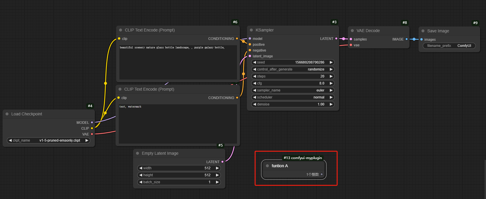
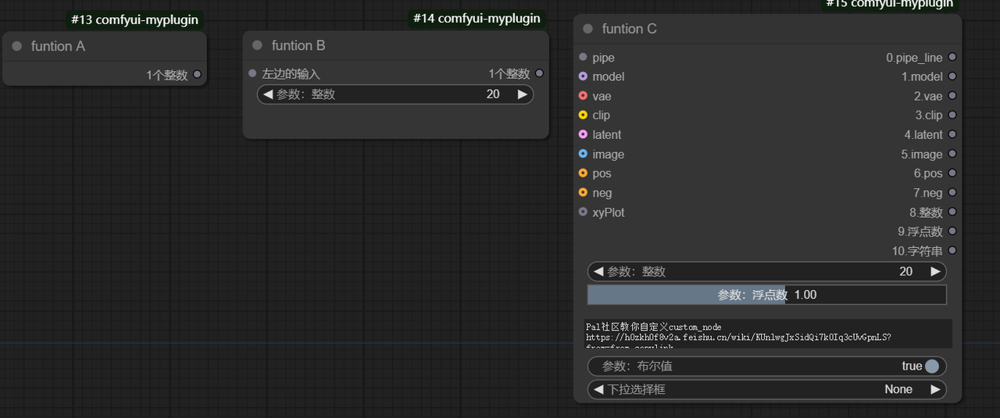
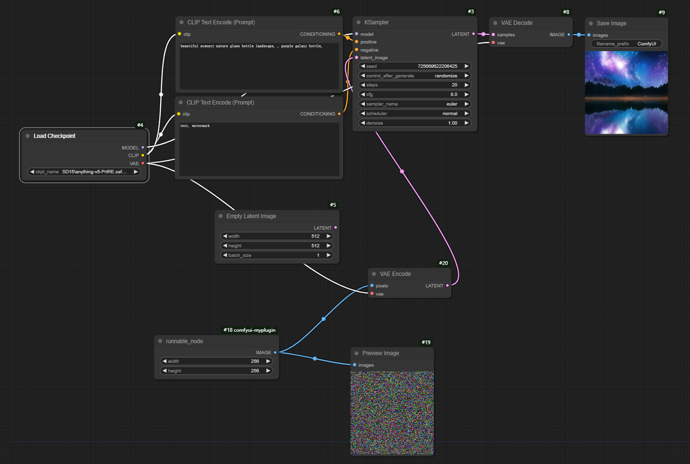
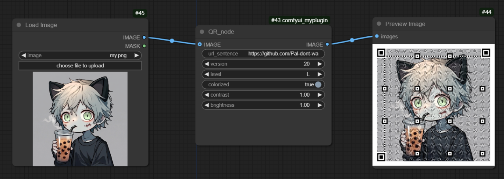

# ComfyUI Custom Node Plugin Development Tutorial

This is a comprehensive tutorial for developing custom node plugins for ComfyUI. The project aims to guide developers on how to create, implement, and integrate custom nodes into ComfyUI. Through a series of examples ranging from basic to advanced, we will demonstrate the entire process from fundamental node structures to complex functionality implementation.

This tutorial not only includes multiple practical example nodes but also explains each development step in detail, making it an ideal resource for learning ComfyUI plugin development. Whether you're new to ComfyUI or an experienced developer, you'll find valuable information here.

## Tutorial Content

This tutorial covers the following:

- Basics of ComfyUI plugin development
- Node structure and property definition
- Input and output type configuration
- Implementing node functionality logic
- Advanced feature examples (such as QR code generator)

By studying this tutorial, you will be able to:

- Understand how ComfyUI plugins work
- Create various types of custom nodes
- Implement complex node functionalities
- Integrate custom nodes into ComfyUI workflows

## Table of Contents

- [Installation](#installation)
- [Usage](#usage)
- [Node Details](#node-details)
- [Development Guide](#development-guide)

## Installation

1. Download and install the latest version of ComfyUI:
   ```
   git clone https://github.com/comfyanonymous/ComfyUI.git
   cd ComfyUI
   ```

2. Clone this project in the `custom_nodes` directory of ComfyUI:
   ```
   cd custom_nodes
   git clone https://github.com/your-username/your-repo-name.git
   ```

3. Install dependencies (if any):
   ```
   pip install -r requirements.txt
   ```

4. Run ComfyUI:
   - Windows: Double-click `run_nvidia_gpu.bat`
   - Linux/Mac: Run the appropriate startup script `python main.py`

# Custom Nodes
## Node Details

### A_example (example1.py)
Basic example node, demonstrating the simplest node structure.
- Output: An integer




### B_example (example2.py)
Example node with input parameters.
- Input: 
  - Left input (STRING)
  - Parameter: Integer (INT)
- Output: An integer


### C_example (example3.py)
Complex input/output example node, showcasing various possible input and output types.
- Input: Includes required, optional, and hidden inputs
- Output: Various data types (PIPE_LINE, MODEL, VAE, CLIP, etc.)



### runnable_node (example4.py)
Executable node example, generates random noise images.
- Input: 
  - Left input (STRING)
  - Parameter: Integer (INT)
- Output: An integer



After installation, the new nodes will appear in the ComfyUI interface node list under the category "😀😀😀my custom plugin".

### Specific Example: Custom QR Code Generator

### QR_node (QR.py)
QR code generator node, supports custom parameters and background images.
- Input:
  - url_sentence (STRING): URL or text to encode
  - version (INT): QR code version
  - level (["L", "M", "Q", "H"]): Error correction level
  - colorized (BOOLEAN): Whether to use color
  - contrast (FLOAT): Contrast
  - brightness (FLOAT): Brightness
  - IMAGE (optional): Background image
- Output: Generated QR code image (IMAGE)



1. Add the "QR_node" node to the node graph
2. Set the following parameters:
   - `url_sentence`: URL or text to encode
   - `version`: QR code version (1-40)
   - `level`: Error correction level (L, M, Q, H)
   - `colorized`: Whether to use a colored QR code
   - `contrast` and `brightness`: Adjust contrast and brightness
3. Optional: Connect an image node to the `IMAGE` input as a background for the QR code
4. Run the workflow, and the output will generate a QR code image
5. Use a browser or mobile phone to scan the generated QR code for testing

[ComfyUI custom node development documentation](https://h0zkh0f8v2a.feishu.cn/wiki/KUnlwgJxSidQi7k0Iq3cUvGpnLS?from=from_copylink)
## If this tutorial has been helpful to you, please give it a star! ⭐⭐⭐
